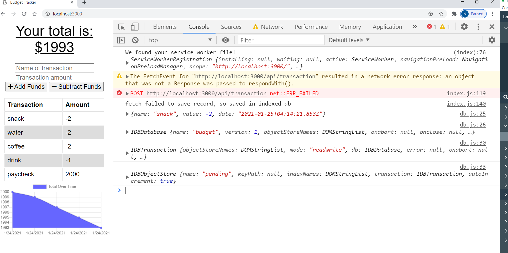

# progressive-budget-01.23.2021

## About The Project

---

-    Adding functionality to existing Budget Tracker application to allow for offline access and functionality.

-    The user will be able to add expenses and deposits to their budget with or without a connection. When entering transactions offline, they should populate the total when brought back online.

## The user should be able to add following Offline Functionalities:

-    Enter deposits offline

-    Enter expenses offline

-    Offline entries should be added to tracker,when brought back online.

## Implemented the following functionalities

-    saveRecord():When user made offline transcations(deposits/expenses),then save transactions as pending transactions in indexdDB.
-    checkDatabase():When online, saving the pending transaction from IndexedDB to mongodb (using post api)

## To support offline transactions,need manifest file and service worker file.

-    manifest.webmanifest: The manifest file is a simple text file that contains the resources (app's name,short_name, icons ..etc) the browser should cache for offline access.
-    service-worker: Service worker provides a way to cache app resources.
-    Service Worker Life Cycle contains 3 steps:
     -- nstall
     -- activate
     -- fetch

-    service-worker.js: Used static-cache and data-cache.
-    Service-worker.js, install with pre cache (data-cache and static-cache).

-    self.skipWaiting(): tells the browser to activate this service worker immediately once it has finished installing

-    During fetch(api) If the response was good, service-worker clone it and store it in the cache.

-    If network request failed, service-worker try to get it from the cache.

## Built With

-    express
-    mongodb
-    mangoose
-    Http verbs get,post and put
-    indexedDB
-    service-worker

## Getting Started

To get a local copy up and running follow below steps.

## Prerequisites

None

## Installation instructions:

Clone the repo git clone git@github.com:NirmalaAbothu/progressive-budget-01.23.2021.git then open Git Bash window ,navigate to project folder then run
following commands

-    Make a package.json file by running `npm init` from the command line.
-    Open the other GitBash terminal and run : `mongod`
-    Start the server: `node server.js`
-    Navigate to the browser and type: `localhost:3000'
-    Then make transactions(deposits and expenses) for offline and online.

## Credits

### Followed the below documentation

-    MongoDB documentation
-    IndeedDB documentation
-    Service-worker documentation

## License & copyright

Copyright © 2020 Nirmala Abothu

[Deployed Heroku Link](https://serene-headland-27463.herokuapp.com/)
